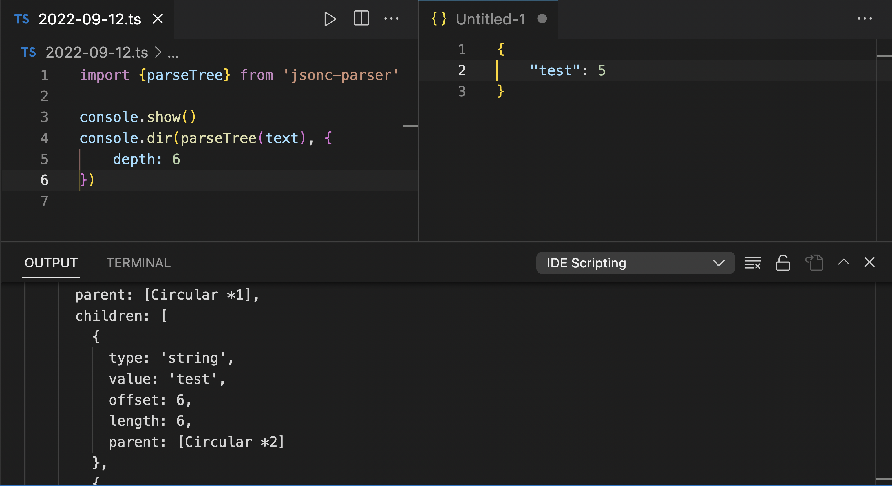
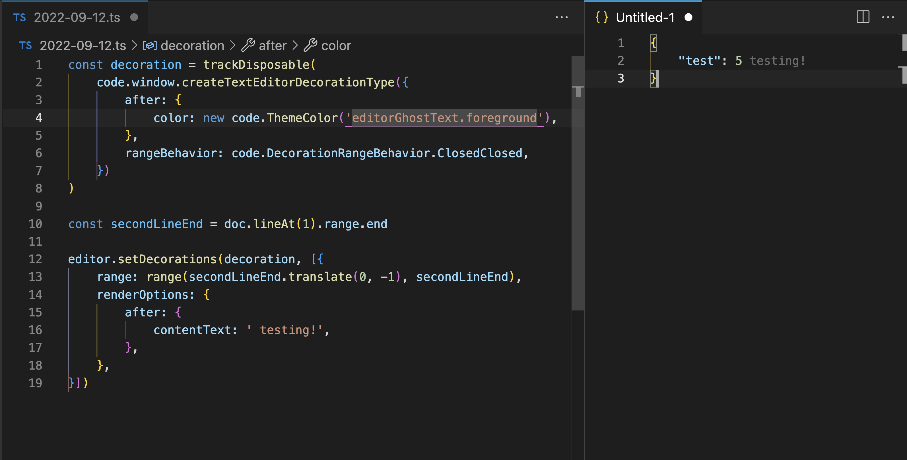

# IDE Scripting

Effective VSCode API explorer / playground. Enjoy!

## Example Usages

### One-Time Scripts

- run specific command on every line/specific lines
- find line by processing outline
- open every file by using glob to fix diagnostics, that are not displayed in problems panel

## Use & install modules

You can import packages from global node_modules. For example:

```console
npm i -g superb
```

```ts
import superb from 'superb'

info(`You are ${superb.random()}`) // You are awesome
```

### Another Example

```console
npm i -g jsonc-parser
```

```ts
import {} from 'json-parser'

info(`You are ${superb.random()}`) // You are awesome
```

or

```console
npm i -g jsonc-parser
```

```ts
import {parseTree} from 'jsonc-parser'

console.show() // show console
console.dir(parseTree(text), {
    depth: 6
}) // observe tree
```

## Code Examples

```ts
// count files
const item = trackDisposable(vscode.window.createStatusBarItem())
item.show()
item.text = '...'
vscode.workspace.findFiles('**/*.js', '**/node_modules/**').then((files) => {
    // Want to do something special with each file?
    item.text = 'Files: '+files.length
})
```

### Notes

- if there is no note in changelog/releases about specific/latest extension version it means it was released automatically to keep vscode typings in your playground up to date

## Some More Screenshots



---


